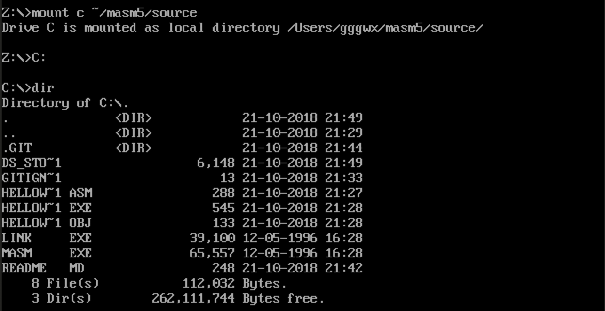
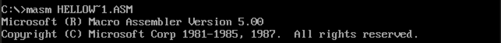
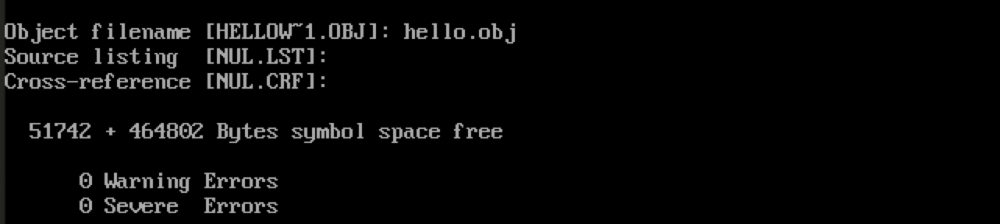
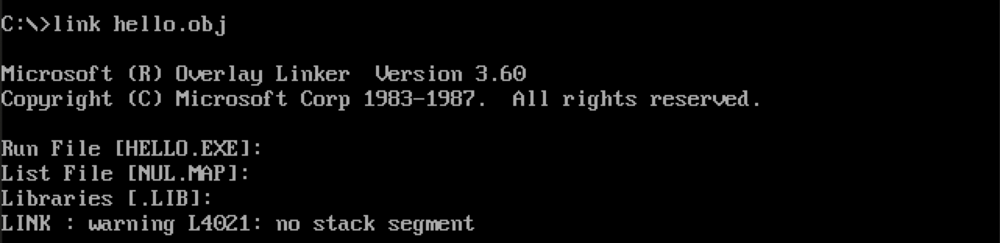
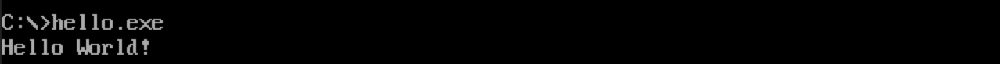

# Assembly

**configured on macOS**

[Download DOSBox](https://www.dosbox.com)

[Download MASM](https://link.jianshu.com/?t=http://cdn.suiyuanjian.com/DOSBox-0.74-1_Universal.dmg)

## To mount a drive on disk

## To compile and link and execute

## TODO

1. work out all the prime numbers from 0 to 100
2. list out the first 30 numners of Fibonacci sequence
3. eight queens

